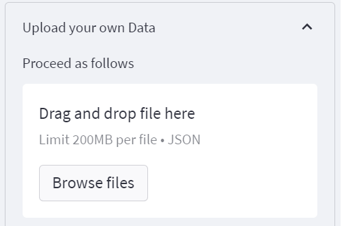

# PyDepGraph

    [](https://shangfr-pydepgraph-app-gh2ivs.streamlitapp.com/)

#### Description 

[PyDepGraph-Python项目依赖树可视化工具](https://shangfr-pydepgraph-app-gh2ivs.streamlitapp.com/)


PyDepGraph is a web application designed to display information about Python installed packages and their dependencies. 👇

<a target="_blank" href="(https://shangfr-pydepgraph-app-gh2ivs.streamlitapp.com/">
    </img>
</a>

PyDepGraph is a utility for displaying the installed python packages in form of a dependency tree. 

<table border="0">
  <tr>
    <td>
        
    </td>
    <td>
        
    </td>
    <td>
        
    </td>
    <td>
      <a target="_blank" href="(https://shangfr-pydepgraph-app-gh2ivs.streamlitapp.com/">
        
      </a>
    </td>
  </tr>
  <tr>
    <td>Community Detection</td>
    <td>Pkgs Tree</td>
    <td>Node Colors</td>
    <td>Local File</td>
  </tr>
</table>


#### Software Architecture

Software architecture description

- **Pipdeptree** Python项目依赖数据获取
- **Streamlit** Web应用程序框架
- **Echarts** Graph可视化

#### Installation
```bash
$ git clone https://github.com/shangfr/PyDepGraph.git
```

#### Instructions
```bash
$ cd py-dep-graph
$ streamlit run app.py
```

##### Uploading the Local Dependency Graph

**shows the local python packages**
```bash
$ pip install pipdeptree
$ pipdeptree --json > pkg.json
```

**shows a particular package** 
```bash
$ pipdeptree --json -p xxxpkg > xxxpkg.json
```

**shows a particular package is installed**
```bash
$ pipdeptree --json -p xxxpkg -r  > xxxpkg.json
```

#### Contribution

1.  Fork the repository
2.  Create Feat_xxx branch
3.  Commit your code
4.  Create Pull Request

