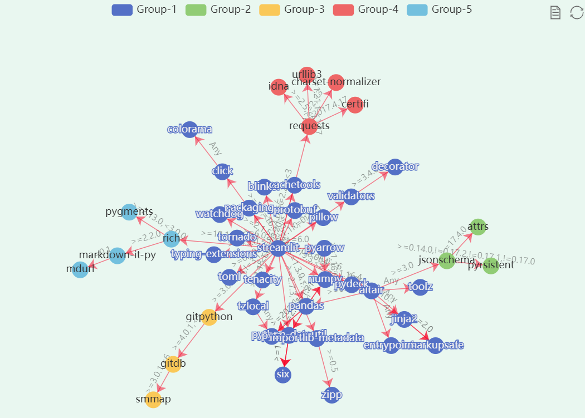
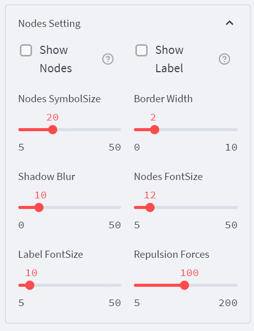

# PyDepGraph

    

#### Description 

[PyDepGraph-Python项目依赖树可视化工具](https://shangfr-pydepgraph-app-gh2ivs.streamlitapp.com/)

PyDepGraph is a utility for displaying the installed python packages in form of a dependency tree. 

#### Software Architecture

Software architecture description

- **Pipdeptree** Python项目依赖数据获取
- **Streamlit** Web应用程序框架
- **Echarts** Graph可视化

#### Installation

1. $ git clone https://github.com/shangfr/PyDepGraph.git

#### Instructions

1. $ cd py-dep-graph
2. $ streamlit run app.py

##### Uploading the Local Dependency Graph

**shows the local python packages**

1. $ pip install pipdeptree
2. $ pipdeptree --json > pkg.json

**shows a particular package** 

3. $ pipdeptree --json -p xxxpkg > xxxpkg.json

**shows a particular package is installed**

4. $ pipdeptree --json -p xxxpkg -r  > xxxpkg.json

#### Contribution

1.  Fork the repository
2.  Create Feat_xxx branch
3.  Commit your code
4.  Create Pull Request

