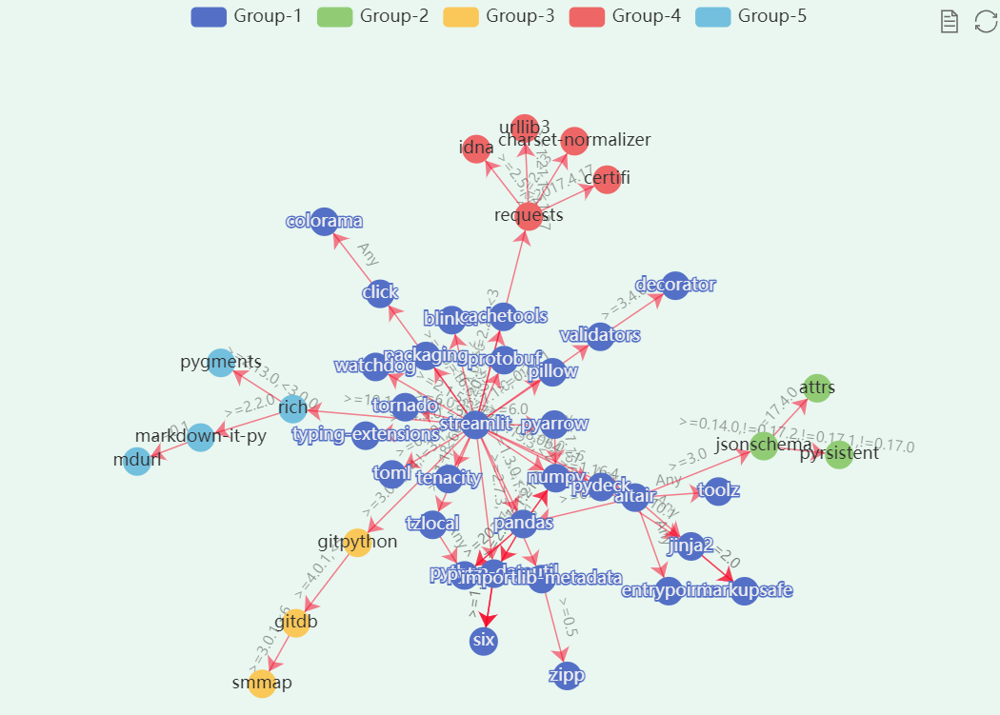
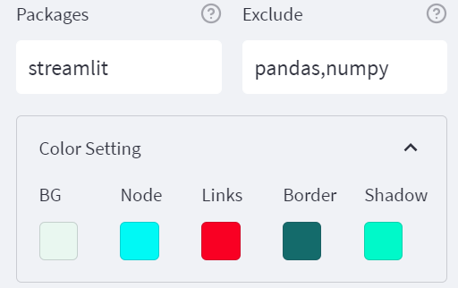
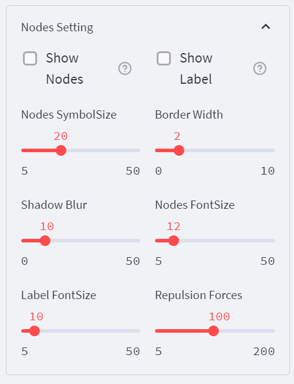
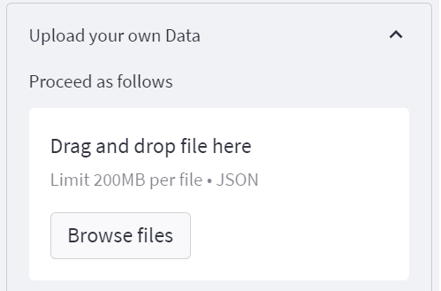

# PyDepGraph

    [](https://shangfr-pydepgraph-app-gh2ivs.streamlitapp.com/)

**简体中文**🀄 | [English🌎](./README.en.md)

#### 原理介绍

首先，使用Pipdeptree获取Python项目依赖数据，然后使用Echarts Graph进行可视化，最后用Streamlit开发了一个线上的Web App。其中，包的分类标签使用了NetworkX内置的社区发现算法Girvan-Newman为依赖项之间的图网络划分社区。

PyDepGraph is a web application designed to display information about Python installed packages and their dependencies. 👇

<a target="_blank" href="https://shangfr-pydepgraph-app-gh2ivs.streamlitapp.com/"></img></a>

PyDepGraph is a utility for displaying the installed python packages in form of a dependency tree. 

<table border="0">
  <tr>
    <td>
      <a target="_blank" href="https://shangfr-pydepgraph-app-gh2ivs.streamlitapp.com/">
        
      </a>
    </td>
    <td>
        
    </td>
    <td>
        
    </td>
    <td>
      <a target="_blank" href="https://shangfr-pydepgraph-app-gh2ivs.streamlitapp.com/">
        
      </a>
    </td>
  </tr>
  <tr>
    <td>Community Detection</td>
    <td>Pkgs Tree</td>
    <td>Node Colors</td>
    <td>Local File</td>
  </tr>
</table>

#### 软件架构

软件架构说明

- **Pipdeptree** Python项目依赖数据获取
- **Streamlit** Web应用程序框架
- **Echarts** Graph可视化

[online:](https://shangfr-pydepgraph-app-gh2ivs.streamlitapp.com/)   [download:](https://github.com/shangfr/PyDepGraph/releases/download/V1.0.1/PyDepGraph_1.0.1_x64-setup.exe)

#### 安装教程
```bash
$ git clone https://github.com/shangfr/PyDepGraph.git
```
#### 使用说明
```bash
$ cd py-dep-graph
$ streamlit run app.py
```

##### 上传本地项目依赖json文件

**查看所有包及其依赖**
```bash
$ pip install pipdeptree
$ pipdeptree --json-tree > pkg.json
```

**查看指定包及其需要的依赖** 
```bash
$ pipdeptree --json-tree -p xxx包名 > xxxpkg.json
```


#### 参与贡献

1.  Fork 本仓库
2.  新建 Feat_xxx 分支
3.  提交代码
4.  新建 Pull Request

